# Random Isekai

[English](README.md) | 日本語

異世界に生まれ直した1人の一生を、1年ずつ最後まで進めるブラウザゲームです。剣と魔法の中世、和の国、仙侠の大陸、蒸気の都、ネオンの巨大都市、星々の帝国、ダンジョンのある現代、文明の後など、16の世界から選ぶか、完全ランダムで転生します。毎年の生き死には確率で決まり、その確率は世界の危険度・種族の寿命・生まれの身分・職業・能力・転生特典・その年の出来事を掛け合わせて出します。

同じ設定で何百回も生き直して、その世界でどれくらい生きられるかを確かめることもできます。

ブラウザですぐ遊べます: https://tak633b.github.io/random-isekai/

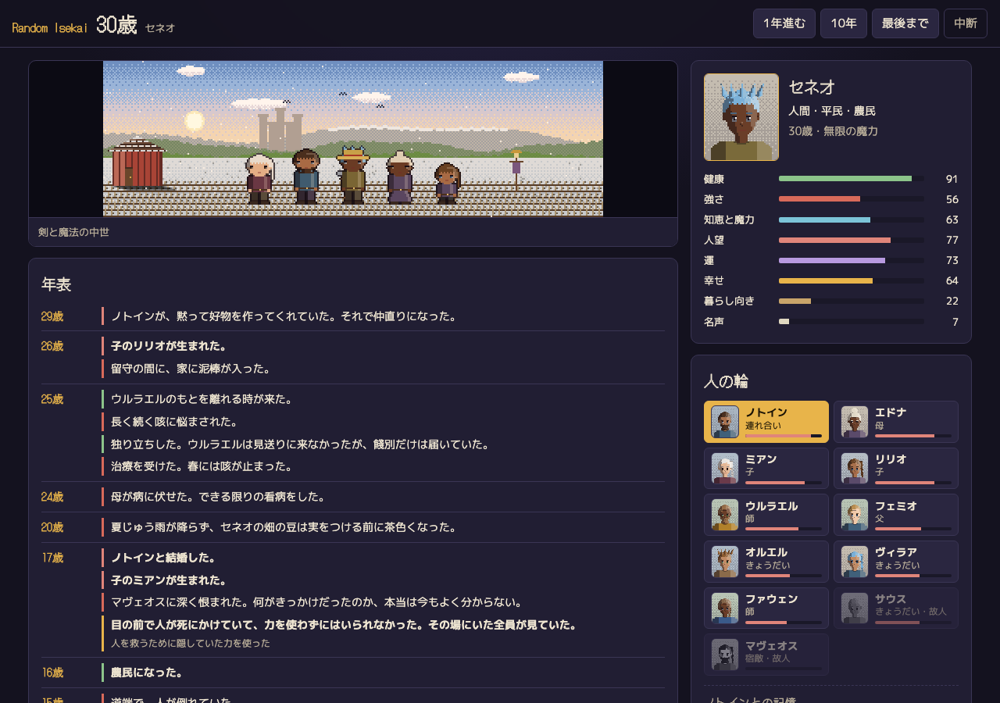

転生すると、1年ずつ自動で流れていきます(速さは 1〜16倍、一時停止、次の選択まで、自動で決める を切り替えられます)。場面のドット絵は少しずつ動き、仲間ができると主人公の後ろに並びます。その年に魔物や盗賊や戦争の出来事があると、敵が現れて短い戦いの演出が入ります。勝ち負けはエンジンが決めた結果のとおりです。

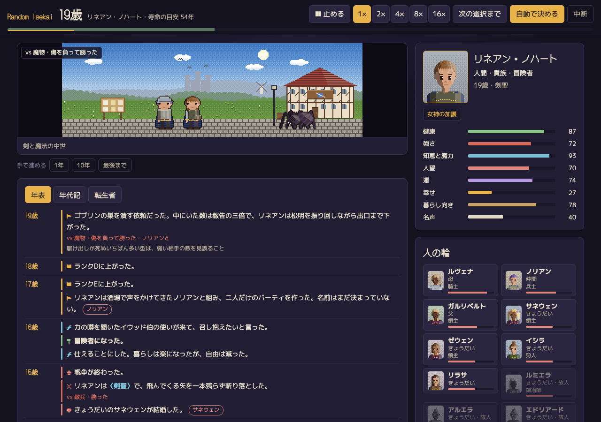

## 主人公の筋と、ほかの人の一生

**英雄の筋。** 転生特典はただの数字ではありません。子どものうちに力に気づき、初めて人前で使い、冒険者ギルドにランクFで登録し(世界によって宗門・探索者協会・傭兵組合など)、ランクを上げ、大きな手柄を立て、魔物の群れから町を守り、やがて歌になることもあります。どの段に進むか、いつ進むかは毎年の確率で決まり、大物との戦いには命の危険があります。

**人の輪の人物像。** 輪の一人ひとりに、種族・年齢・職業・強さとランク・目立つ技・性格・出会い・その後があります。結婚し、子が生まれ、昇進し、怪我をし、ときには自分の道を行くと言って去ります。近い人の出来事は主人公の年表にも入ります。

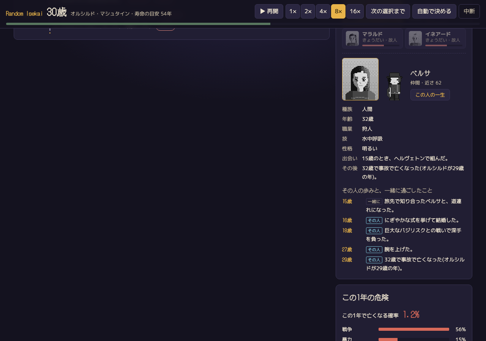

**ほかの人の一生。** 「この人の一生」から、輪の人の生まれてから亡くなるまでを読めます。同じエンジンで作り、出会った年・結婚・子・一緒に生きた戦争や疫病など、主人公の年表と食い違わないように合わせています。共有した年には印が付き、そこから主人公の年表のその年へ飛べます。

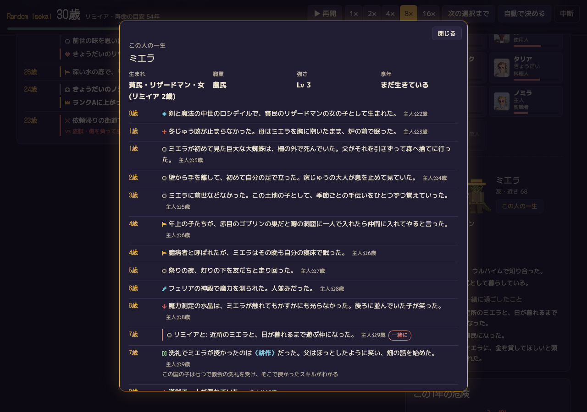

**ほかの転生者。** 別の世界から来たのは主人公だけではありません。世界ごとに転生者・召喚された人の名簿があり、一人ひとりに特典と前世があります。噂を聞き、何人かには会い、手を組んだり敵になったりします。勇者になる人も、前の世界の料理の店を開く人も、魔王を名乗る人もいます。

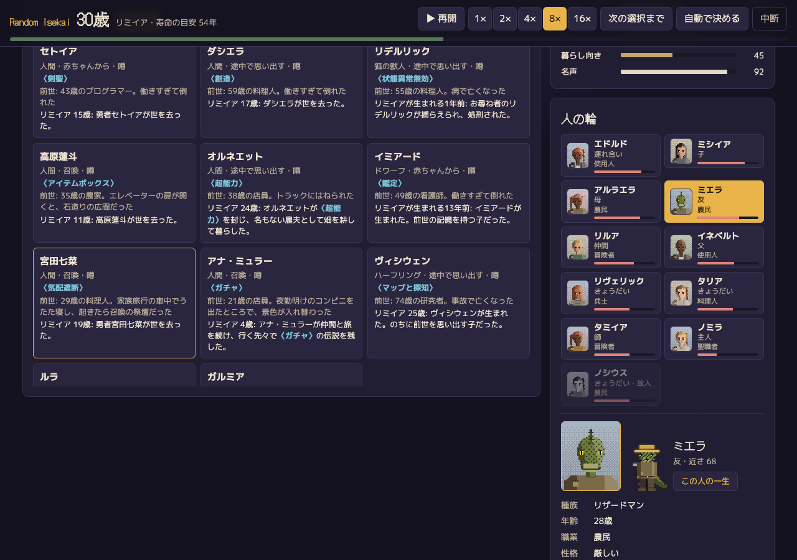

**年代記。** 主人公が生まれる何十年も前から亡くなった後まで、その世界の歴史を並べます。戦争の始まりと終わり、大疫病、飢饉、魔王の出現と討伐、ほかの転生者のしたこと、名が知られてからの主人公の手柄。

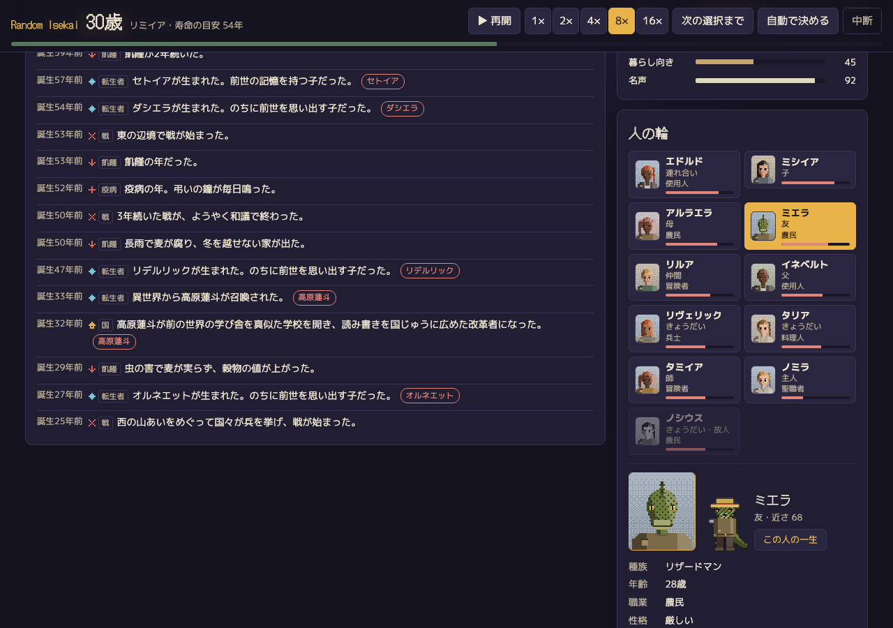

## 代を継いで続ける

主人公が亡くなっても、そこで終わりにしなくてかまいません。死亡記録で、主人公の死の時点で生きている人を選べます。子、連れ合い、きょうだい、仲間、弟子、従魔、会った転生者です。その人として、主人公の死の翌年から、その人の年齢で続けて遊べます。その人の過去は、主人公の側から見たその人の一生のとおりです。世界はそのまま続き、年代記も、戦争や疫病も、転生者の名簿も引き継がれます。

続けるたびに代が重なります。死亡記録・追悼館・年代記に「第N代」と系譜(第1代 → 第2代 → …)が出て、前の代の記録を開けます。

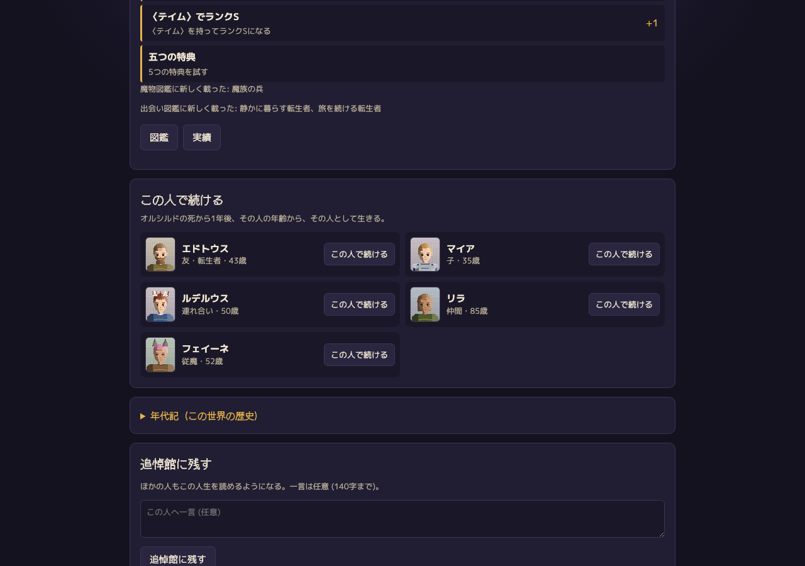

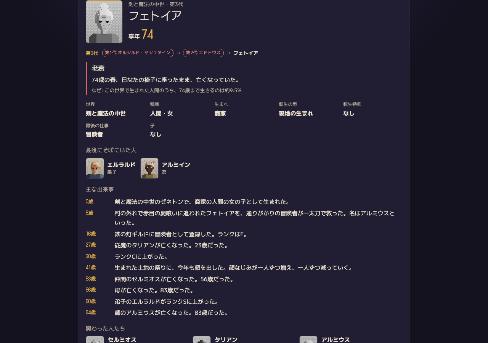

## 遊び方

1. タイトルで「完全ランダムで転生」か「設定して転生」を選ぶ。
2. 設定では、世界(16種)、魔法と異能の強さ、危険度と戦争の多さ、主人公の種族・性別・身分・才能・転生特典・転生の型(赤ちゃんから、途中で思い出す、召喚、現地の生まれ)・前世の記憶・名前を選べる。どの項目も「おまかせ」にでき、選ばなかったものは生まれるときに決まる。
3. 転生の場面で、前世の終わり方と、この世界での生まれが出る。
4. 人生の画面では「1年進む」「10年」「最後まで」で進める。途中で選択肢が出たら選ぶ。その年に何で死ぬ恐れがあるかの内訳も見える。
5. 亡くなると死亡記録が残る。享年、死因、その死を引き寄せた数字の一行、最後にそばにいた人、主な出来事、年表の全体。
6. 「同じ設定で何回も試す」で、100回か1000回生き直した結果をまとめて見られる。

さらに細かく決めたいときは、次の3つも選べます。

- 女神の加護: 大人になるまで、病・魔物・事故で亡くなる危険が4分の1になります。中世では5歳までに亡くなる割合が36%から13%に下がります。選ばなければ加護はなく、その世界の厳しさのままです。
- 始まる年齢: 赤ちゃんから、5〜8歳の子どもの体で、13〜16歳の体で、17〜30歳の大人として召喚・転移、から選べます。
- スキル・能力・加護・体質・弱点: 409の候補から、ポイント20と枠6の中で組みます。弱点を選ぶとポイントが戻ります(3つまで)。能力にもポイントを振れます。候補は世界ごとに選べるものが違い(魔法のない世界に属性魔法は無く、宇宙にハッキングはあるなど)、どれも死因ごとの危険・老いの速さ・始まりの能力・出来事の起きやすさに数字で効きます。おまかせにすると予算の中でランダムに組みます。

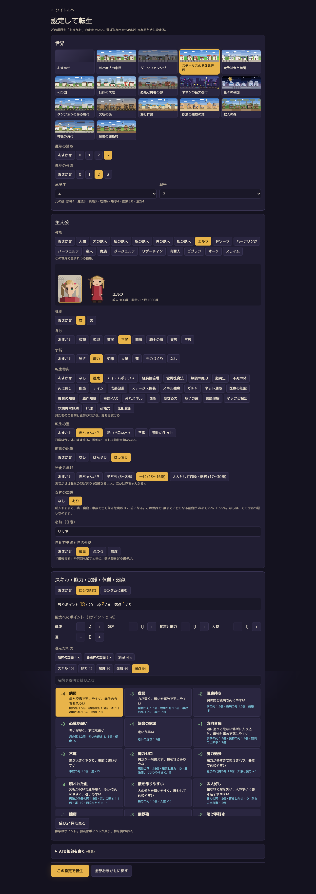

## 何回も試す

選ばなかった項目も含めて設定を固定し、運だけを変えて生き直します。享年の分布、平均と中央値と最長、20歳・40歳・60歳…まで生きた割合、死因の分類の内訳、多かった死因が出ます。選択肢を自動で選ぶときの性格(慎重・ふつう・無謀)を変えて、3つを並べて比べることもできます。

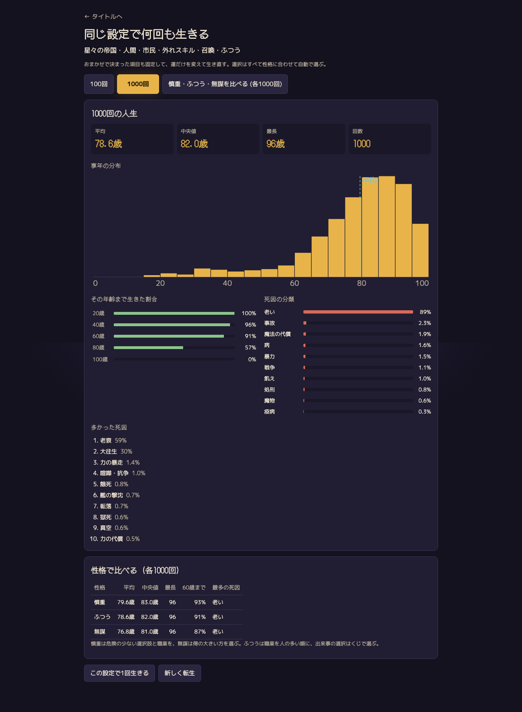

## 確率の筋

世界ごとの死亡率は、実在の歴史の生命表を参照点にしています。たとえば剣と魔法の中世は中世後期のイングランド、和の国は江戸期の農村、ダークファンタジーは黒死病の時代と三十年戦争のあいだ、ダンジョンのある現代は今の日本です。乳児死亡率、5歳未満死亡率、子ども期の死亡率、大人の年齢によらない死(ゴンペルツ=メイカム型の定数項)、老化の傾きを世界ごとに持たせ、そこに種族と身分と職業の倍率を重ねています。

- エルフやドワーフのような長命の種族は、成人後の老化を遅くします(エルフは人間の0.1倍)。ただし魔物や事故の危険は年単位でかかるので、長命の種族でも若いうちに死ぬことは多くあります。
- 冒険者は魔物による死が平民の数倍になり、レベルが上がると下がります。
- 戦争・大疫病・飢饉は毎年の基準に混ぜず、まれな出来事として別に起きます。
- 転生特典は死因ごとの倍率で効きます。超再生は戦いの死を、医療の知識は病の死を減らします。目立つ特典ほど、暗殺や断罪の出来事を呼びやすくなります。

特典なし・平民・人間で自動に生きた3000人の平均享年は、16の世界すべてで、参照にした生命表の平均寿命から±2年以内に収まります(`src/engine/mortality.test.ts`)。調べた内容は `docs/research/` に、計算の式は `docs/DESIGN.md` にあります。

## 中身

- 出来事の文は日英で1,271件、死因の文は232件あります。条件(世界の系統、段階、身分、職業、種族、特典、前世の記憶、しるし)を宣言で書いてあるので、コードを書かずに増やせます。
- 人の輪: 家族、友、仲間、師匠、ライバル、宿敵、恋人、連れ合い、子、従魔、弟子。一人ひとりに近さ(0〜100)と共有の記憶があり、それぞれの寿命で年を取って亡くなります。
- ピクセルアートは画像ファイルを使わず、canvas でその場で描きます。場面は 320×100 で、16の世界と16の場所、4つの時刻と季節を描き分けます。顔は 48×56、立ち絵は 32×48 で、27の種族と42の職業を描き分けます。
- 途中で閉じても、続きから再開できます。過去の人生は localStorage に20件まで残ります。遊ぶだけならサーバーは要りません。
- 日本語と英語に対応しています。英語の訳語は `docs/GLOSSARY.md` の用語集にそろえ、`src/english-scan.test.ts` が全世界の人生を英語で回して、日本語の文字の混じりと文法の崩れが無いことを確かめます。

<p align="center">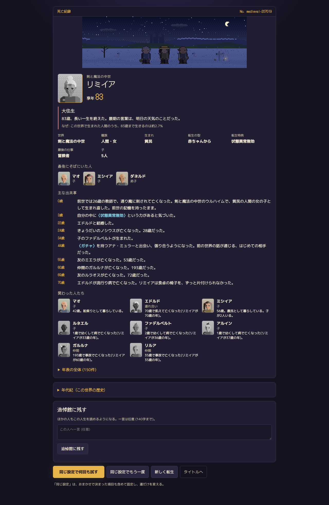</p>

## 共有の追悼館

サーバーで動かすと、亡くなった主人公をほかの人も読める追悼館に残し、ろうそくを灯せます。残るのはゲームの中の記録と、任意の一言(140字まで)だけです。遊んだ人の名前・連絡先・IP アドレスは保存しません。送信の回数には上限があります。サーバーは `node:sqlite` を使い、依存はありません。GitHub Pages の版にはサーバーが無いので、追悼館の画面にはその案内が出ます。

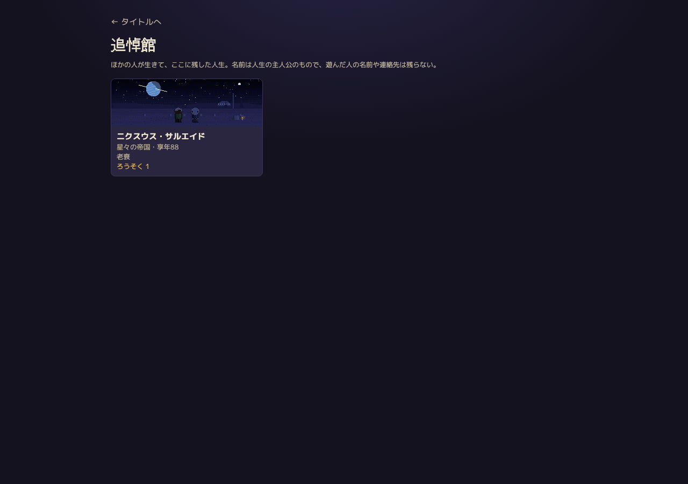

## AI で書き足す(任意)

人生の骨格(生死、出来事、職業、人の輪)はすべてコードが決めます。そのうえで、つないだ LLM にその年の細部や、最後の言葉と墓碑銘を書かせられます。つなぎ先は OpenRouter か、OpenAI 互換の手元の LLM です。API キーはブラウザにだけ保存し、つなぎ先以外には送りません。AI の文は使う前に検査します。長さ、知らない人の名前、生死を変える言葉、書き換えられた年齢や数、HTML を見て、引っかかれば捨てます。

## 動かす

```
npm install
npm run dev      # http://localhost:5288
npm test         # vitest
npm run build    # tsc と vite build
npm start        # dist/ と追悼館を http://localhost:8790 で(PORT で変えられる)
```

`scripts/e2e.mjs` は Playwright での通しプレイです。Playwright は依存に入れていないので、`PLAYWRIGHT_PATH` に場所を渡します(無ければ `playwright` を探します)。開発サーバーを 5293 で起動してから走らせます。

## 作品について

テンプレな異世界転生ものの型(トロープ)を集めて作っています。特定の作品の設定・名前・文章は使っていません。

## ライセンス

MIT

### 音楽

効果音はブラウザの中で合成している(音声ファイルは使わない)。人生ごとに、今風の曲と昔のRPG風(8ビット)の曲のどちらかで流れる。ライセンスは各曲のページで確かめた。`public/audio/` の曲は、短く切り、音量をそろえ、64〜72kbps にし、(もともとループする曲以外は)頭と終わりをフェードしている。

今風:

- "Heroes Theme" Alexandr Zhelanov ([OpenGameArt](https://opengameart.org/content/heroes-theme))、[CC BY 3.0](https://creativecommons.org/licenses/by/3.0/)、タイトル
- "Mystical Theme" Alexandr Zhelanov ([OpenGameArt](https://opengameart.org/content/mystical-theme))、[CC BY 3.0](https://creativecommons.org/licenses/by/3.0/)、転生の演出
- "Town Theme RPG" cynicmusic ([OpenGameArt](https://opengameart.org/content/town-theme-rpg))、[CC0](https://creativecommons.org/publicdomain/zero/1.0/)、中世・学園の世界
- "Woodland Fantasy" Matthew Pablo ([OpenGameArt](https://opengameart.org/content/woodland-fantasy))、[CC BY 3.0](https://creativecommons.org/licenses/by/3.0/)、ゲーム・獣人・神話・開拓地・現代の世界
- "Dark Descent" Matthew Pablo ([OpenGameArt](https://opengameart.org/content/dark-descent))、[CC BY 3.0](https://creativecommons.org/licenses/by/3.0/)、ダーク・文明の後の世界
- "Hot Springs Town" Kistol ([OpenGameArt](https://opengameart.org/content/hot-springs-town))、[CC0](https://creativecommons.org/publicdomain/zero/1.0/)、和の世界
- "Liyan" elerya ([OpenGameArt](https://opengameart.org/content/liyan))、[CC BY 3.0](https://creativecommons.org/licenses/by/3.0/)、仙侠の世界
- "Victoriana Loop" Joe Baxter-Webb (BossLevelVGM) ([OpenGameArt](https://opengameart.org/content/victoriana-loop))、[CC BY 3.0](https://creativecommons.org/licenses/by/3.0/)、スチームパンクの世界
- "Welcome to Com-Mecha" Matthew Pablo ([OpenGameArt](https://opengameart.org/content/theme-of-com-mecha))、[CC BY 3.0](https://creativecommons.org/licenses/by/3.0/)、サイバーパンク・宇宙の世界
- "The Eternal Sands" HitCtrl ([OpenGameArt](https://opengameart.org/content/fantasy-music-the-eternal-sands))、[CC BY 3.0](https://creativecommons.org/licenses/by/3.0/)、砂漠の世界
- "A Sailor's Chant" Thimras ([OpenGameArt](https://opengameart.org/content/a-sailors-chant))、[CC0](https://creativecommons.org/publicdomain/zero/1.0/)、海の世界
- "Battle Theme A" cynicmusic ([OpenGameArt](https://opengameart.org/content/battle-theme-a))、[CC0](https://creativecommons.org/publicdomain/zero/1.0/)、戦い
- "Perpetual Tension" Zander Noriega ([OpenGameArt](https://opengameart.org/content/perpetual-tension))、[CC BY 3.0](https://creativecommons.org/licenses/by/3.0/)、死にかけた場面
- "Lament for a Warrior's Soul" RandomMind ([OpenGameArt](https://opengameart.org/content/fantasy-lament-for-a-warriors-soul))、[CC0](https://creativecommons.org/publicdomain/zero/1.0/)、最期
- "Lively Meadow (Victory Fanfare and Song)" Matthew Pablo ([OpenGameArt](https://opengameart.org/content/lively-meadow-victory-fanfare-and-song))、[CC BY 3.0](https://creativecommons.org/licenses/by/3.0/)、帰還

昔のRPG風(8ビット):

- "Opening" AVGVSTA ([OpenGameArt](https://opengameart.org/content/generic-8-bit-jrpg-soundtrack))、[CC BY 4.0](https://creativecommons.org/licenses/by/4.0/)、タイトル
- "Sanctuary" AVGVSTA ([OpenGameArt](https://opengameart.org/content/generic-8-bit-jrpg-soundtrack))、[CC BY 4.0](https://creativecommons.org/licenses/by/4.0/)、転生の演出
- "Town" AVGVSTA ([OpenGameArt](https://opengameart.org/content/generic-8-bit-jrpg-soundtrack))、[CC BY 4.0](https://creativecommons.org/licenses/by/4.0/)、中世・学園の世界
- "Overworld" AVGVSTA ([OpenGameArt](https://opengameart.org/content/generic-8-bit-jrpg-soundtrack))、[CC BY 4.0](https://creativecommons.org/licenses/by/4.0/)、ゲーム・獣人・神話・開拓地・現代の世界
- "Dungeon" AVGVSTA ([OpenGameArt](https://opengameart.org/content/generic-8-bit-jrpg-soundtrack))、[CC BY 4.0](https://creativecommons.org/licenses/by/4.0/)、ダーク・文明の後の世界
- "Timeworn Pagoda" AVGVSTA ([OpenGameArt](https://opengameart.org/content/generic-8-bit-jrpg-soundtrack))、[CC BY 4.0](https://creativecommons.org/licenses/by/4.0/)、和の世界
- "Chipnese" Spring Spring ([OpenGameArt](https://opengameart.org/content/chipnese))、[CC0](https://creativecommons.org/publicdomain/zero/1.0/)、仙侠の世界
- "Clockwork Jester" Arold Valda (aroldv) ([OpenGameArt](https://opengameart.org/content/clockwork-jester))、[CC BY 4.0](https://creativecommons.org/licenses/by/4.0/)、スチームパンクの世界
- "Underclocked (underunderclocked mix)" Eric Skiff ([Eric Skiff](https://ericskiff.com/music/))、[CC BY 4.0](https://creativecommons.org/licenses/by/4.0/)、サイバーパンク・宇宙の世界
- "Desert Theme (8bit chiptune)" Wolfgang_ (Ted Kerr) ([OpenGameArt](https://opengameart.org/content/desert-theme-8bit-chiptune-theme))、[CC0](https://creativecommons.org/publicdomain/zero/1.0/)、砂漠の世界
- "Mere Baubles (Sailing the Mysterious Seas)" Spring Spring ([OpenGameArt](https://opengameart.org/content/mere-baublessailing-the-mysterious-seas))、[CC0](https://creativecommons.org/publicdomain/zero/1.0/)、海の世界
- "Barbarian King" AVGVSTA ([OpenGameArt](https://opengameart.org/content/generic-8-bit-jrpg-soundtrack))、[CC BY 4.0](https://creativecommons.org/licenses/by/4.0/)、戦い
- "Danger" AVGVSTA ([OpenGameArt](https://opengameart.org/content/generic-8-bit-jrpg-soundtrack))、[CC BY 4.0](https://creativecommons.org/licenses/by/4.0/)、死にかけた場面
- "Game Over" AVGVSTA ([OpenGameArt](https://opengameart.org/content/generic-8-bit-jrpg-soundtrack))、[CC BY 4.0](https://creativecommons.org/licenses/by/4.0/)、最期
- "Victory" AVGVSTA ([OpenGameArt](https://opengameart.org/content/generic-8-bit-jrpg-soundtrack))、[CC BY 4.0](https://creativecommons.org/licenses/by/4.0/)、帰還
