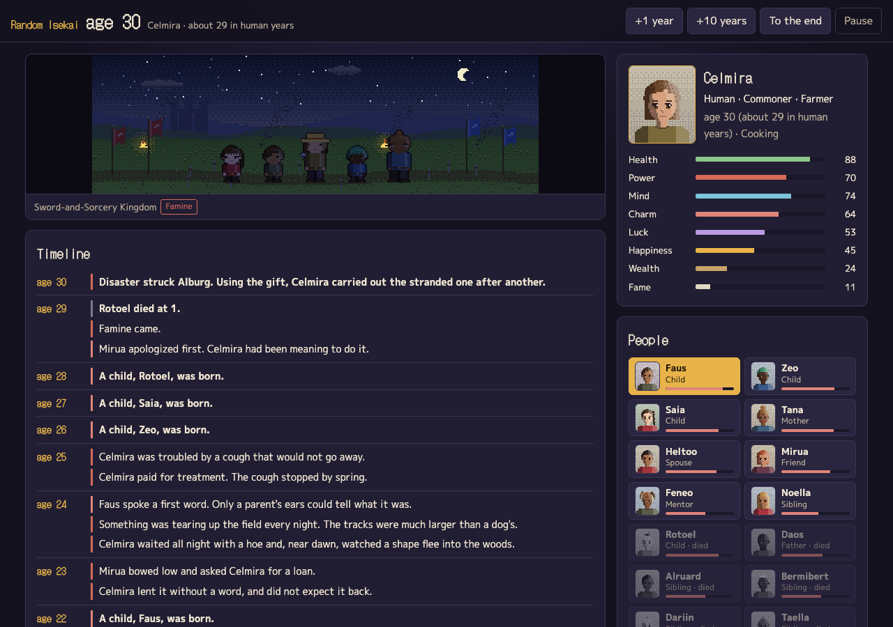
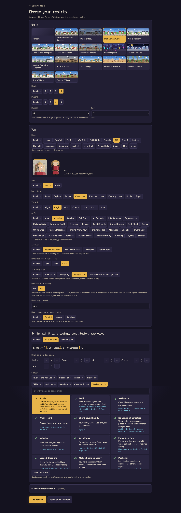
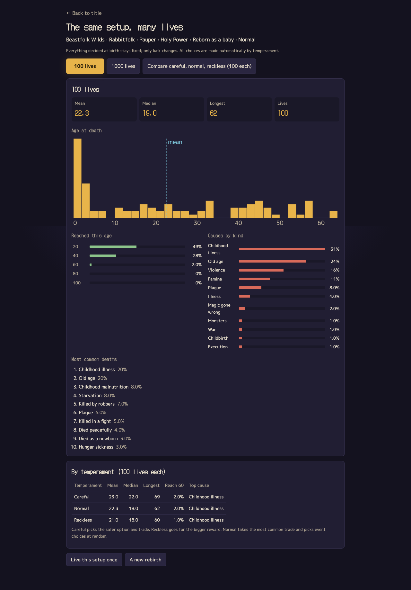
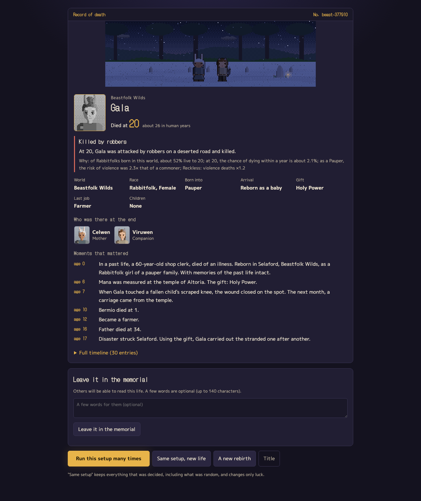
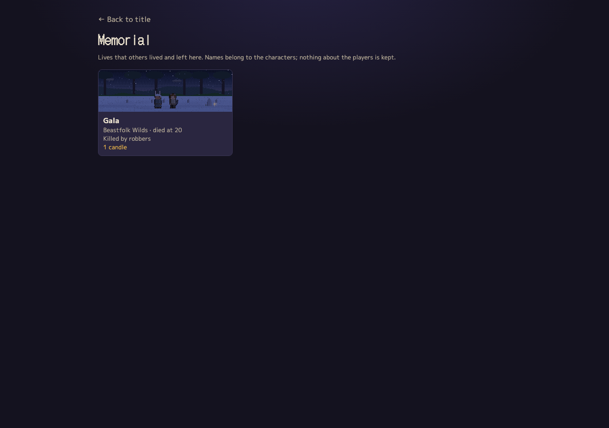

# Random Isekai

English | [日本語](README.ja.md)

A browser game where you live one whole life in another world, a year at a time, until it ends. Pick one of 16 worlds (a sword-and-sorcery kingdom, a land of shrines and samurai, a cultivation continent, a steam-powered capital, a neon megacity, a star empire, modern Earth with dungeons, a post-collapse wasteland and more) or let everything be random. Whether you survive each year is a roll of the dice, and the odds come from the world's danger, your race's lifespan, the status you were born into, your job, your stats, your reincarnation perk and whatever happened that year.

You can also live the same setup hundreds of times and see how long people actually last in that world.

Play in your browser: https://tak633b.github.io/random-isekai/



## How it plays

1. On the title screen, choose "Reborn at random" or "Choose your rebirth".
2. In setup you can pick the world, how strong magic and special powers are, how dangerous and war-torn it is, and your race, sex, status, talent, reincarnation perk, how you arrive (reborn as a baby, remember later, summoned, or a native with no past life), how much you remember, and your name. Anything you leave on "Random" is decided at birth.
3. The arrival scene tells you how your last life ended and where you were born this time.
4. Advance one year, ten years, or to the end. When a choice comes up, you make it. A panel shows what is most likely to kill you this year.
5. When you die you get a record: age, cause, a one-line "why" with the numbers behind it, who was with you at the end, the main events and the full timeline.
6. "Run this setup many times" lives it again 100 or 1000 times and sums up the results.

For finer control there are three more options.

- Goddess's blessing: until adulthood, the risk of dying from disease, monsters or accidents is cut to a quarter. In the medieval kingdom, the share who die before five drops from 36% to 13%. Without it, you face the world as it is.
- Starting age: as a baby, in the body of a 5–8 year old, of a 13–16 year old, or summoned as an adult of 17–30.
- Skills, abilities, blessings, constitutions and weaknesses: build from 409 options within 20 points and 6 slots. Weaknesses give points back (up to three). You can also put points into stats. What you can pick depends on the world (no elemental magic where there is no magic, hacking in space), and every option changes the odds of specific causes of death, how fast you age, your starting stats or how often certain events happen. Leave it on Random and a build is rolled within the budget.



## Many lives, one setup

Everything you chose, and everything that was chosen for you, stays fixed; only luck changes. You get the distribution of ages at death, the mean, median and longest, the share who reached 20, 40, 60 and so on, the breakdown by cause, and the most common deaths. You can compare three temperaments for automatic choices (careful, normal, reckless) side by side.



## Where the odds come from

Each world's mortality is anchored to a real historical life table: the medieval kingdom to late-medieval England, the land of shrines to rural Edo-period Japan, the dark fantasy world to somewhere between the Black Death and the Thirty Years' War, and modern Earth with dungeons to present-day Japan. Every world has an infant mortality rate, an under-five rate, a childhood rate, an age-independent adult hazard (the Makeham term) and an ageing slope (Gompertz). Race, status and job multiply on top.

- Long-lived races such as elves and dwarves age more slowly once grown (elves at 0.1 times the human rate), but monsters and accidents strike per calendar year, so many still die young.
- Adventurers die to monsters several times more often than commoners, less so as they level up.
- War, great plagues and famines are not folded into the yearly baseline. They happen as rare events of their own.
- Perks act on specific causes. Regeneration cuts deaths in combat; modern medical knowledge cuts deaths from disease. Showier perks draw assassins and show trials.

For 3000 automatic lives as a human commoner with no perk, the mean age at death lands within ±2 years of the reference life expectancy in all 16 worlds (`src/engine/mortality.test.ts`). The research notes are in `docs/research/` (Japanese) and the formulas in `docs/DESIGN.md`.

## What's inside

- 902 events and 232 death descriptions, in Japanese and English. Conditions (world type, life stage, status, job, race, perk, past-life memory, story flags) are declarative, so new events need no code.
- People: family, friends, party members, mentors, rivals, nemeses, lovers, spouses, children, familiars and disciples. Each has a closeness score from 0 to 100 and shared memories, and ages and dies on their own life table.
- All pixel art is drawn on canvas at runtime, with no image files. Scenes are 320×100 across 16 worlds, 16 places, 4 times of day and the seasons. Portraits are 48×56 and full-body sprites 32×48, covering 27 races and 42 jobs.
- You can close the tab and continue later. Up to 20 past lives are kept in localStorage. You don't need a server just to play.

<p align="center"></p>

## Shared memorial

When run with the server, you can leave a finished life in a memorial that other players can read, and light candles for theirs. Only the in-game record and an optional note (up to 140 characters) are stored. Player names, contact details and IP addresses are not kept, and submissions are rate-limited. The server uses `node:sqlite` and has no dependencies. The GitHub Pages build has no server, so the memorial screen says so.



## Writing details with AI (optional)

The skeleton of every life (who lives and dies, the events, jobs and people) is decided by code. On top of that you can connect an LLM to write small details for a year, and last words and an epitaph at the end. It works with OpenRouter or a local OpenAI-compatible server. Your API key stays in your browser and is only sent to the endpoint you chose. Everything the AI writes is checked before use (length, unknown names, words that change who is alive, altered ages or numbers, HTML) and dropped if it fails.

## Running it

```
npm install
npm run dev      # http://localhost:5288
npm test         # vitest
npm run build    # tsc and vite build
npm start        # serves dist/ and the memorial at http://localhost:8790 (set PORT to change)
```

`scripts/e2e.mjs` is a Playwright playthrough. Playwright is not a dependency; point `PLAYWRIGHT_PATH` at it (otherwise it looks for `playwright`). Start the dev server on port 5293 first.

## A note on sources

The game is built from common isekai tropes. It does not use the settings, names or text of any particular work.

## License

MIT
