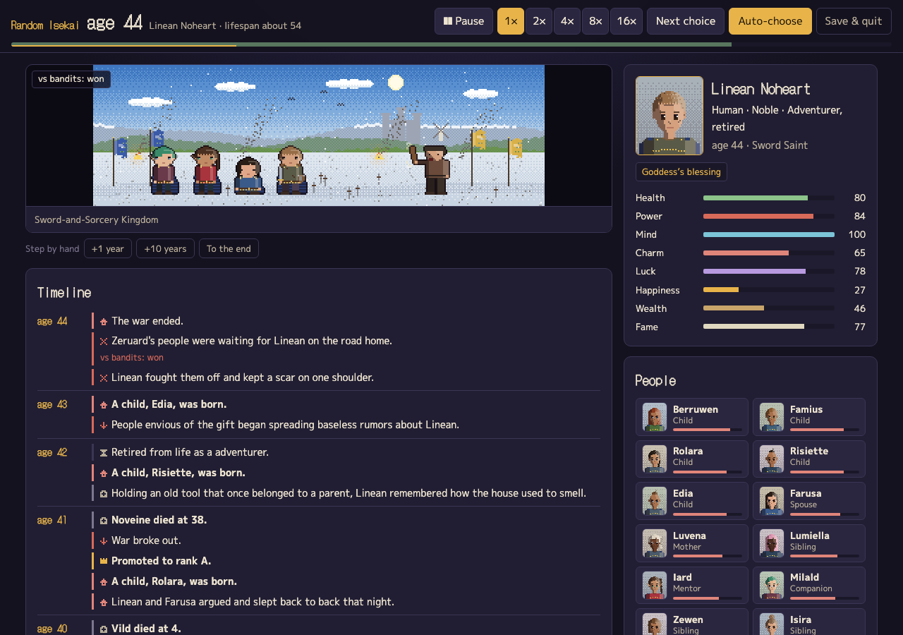
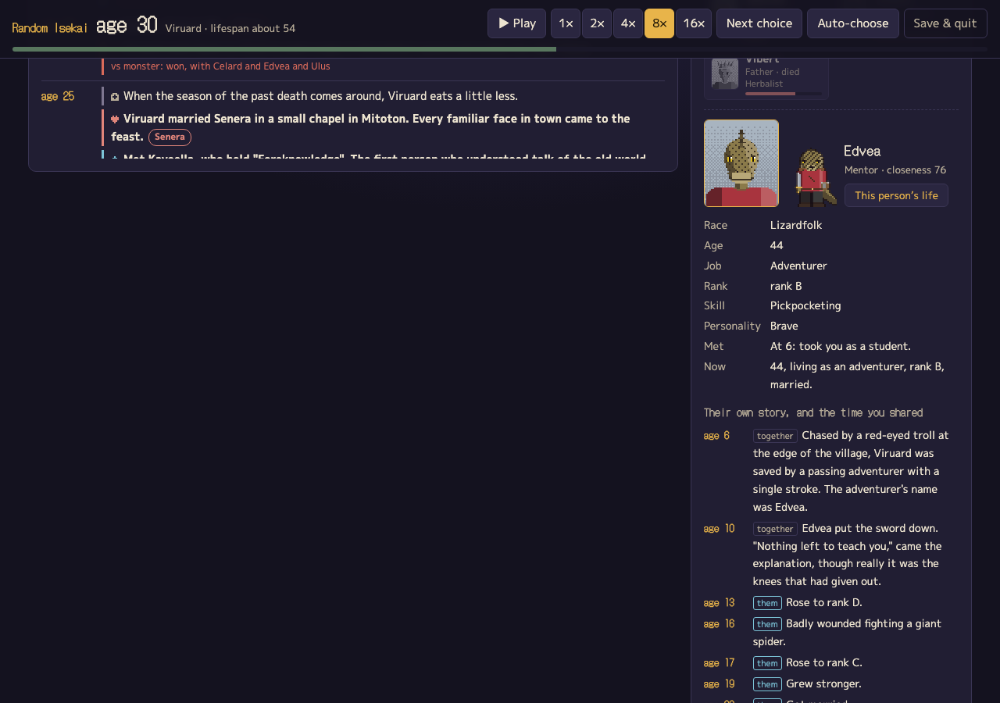
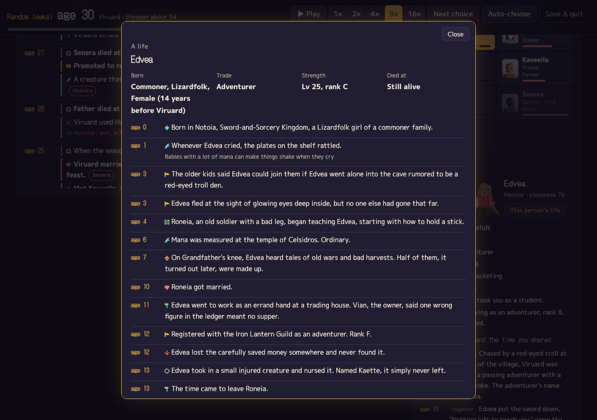
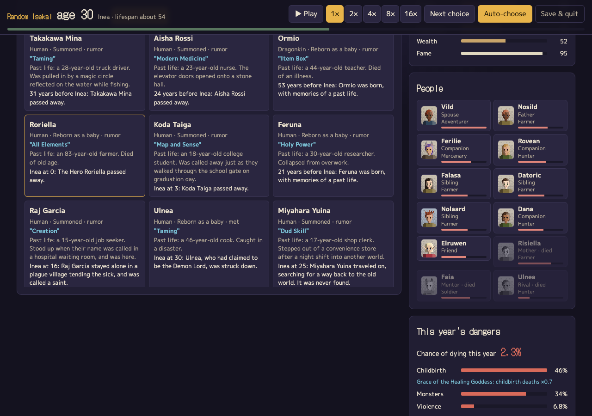
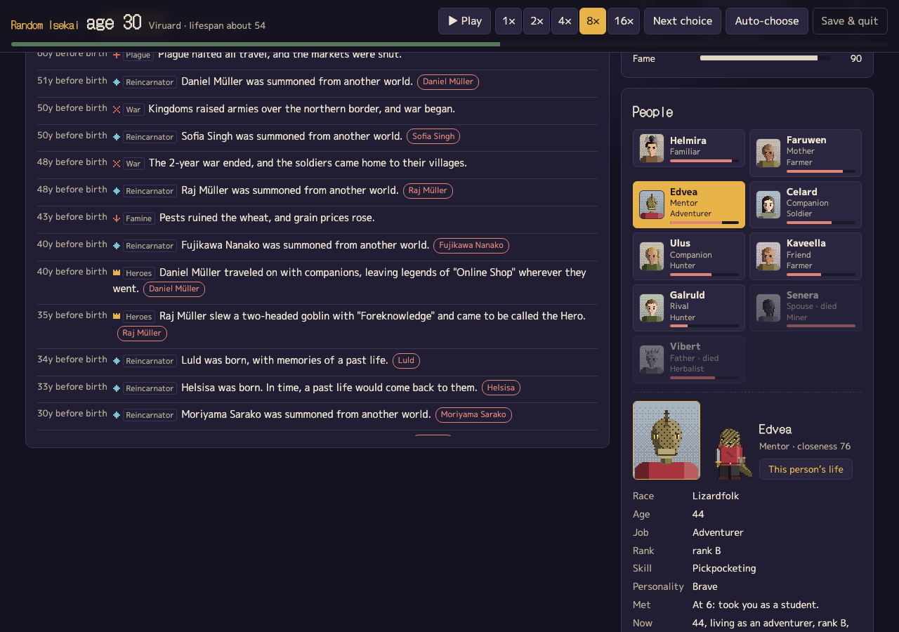
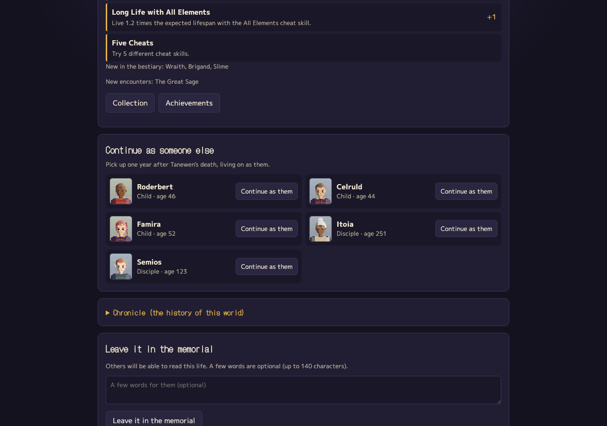

# Random Isekai

English | [日本語](README.ja.md)

A browser game where you live one whole life in another world, a year at a time, until it ends. Pick one of 16 worlds (a sword-and-sorcery kingdom, a land of shrines and samurai, a cultivation continent, a steam-powered capital, a neon megacity, a star empire, modern Earth with dungeons, a post-collapse wasteland and more) or let everything be random. Whether you survive each year is a roll of the dice, and the odds come from the world's danger, your race's lifespan, the status you were born into, your job, your stats, your cheat skill and whatever happened that year.

You can also live the same setup hundreds of times and see how long people actually last in that world.

Play in your browser: https://tak633b.github.io/random-isekai/


Once you are reborn, the years play out on their own (1× to 16×, pause, skip to the next choice, or let it decide for you). The pixel art moves a little, companions line up behind you as you gain them, and when a year brings monsters, bandits or war, an enemy walks in for a short fight. The outcome is whatever the engine already decided.



## The hero's road, and everyone else's

**The hero's road.** A cheat skill is not just a number. A child notices the power, uses it in front of others for the first time, registers with the Adventurers' Guild at Rank F (or joins a sect, an explorers' association, a mercenary outfit, depending on the world), climbs the ranks, pulls off a great deed, saves a town from a horde of monsters, and may end up in songs. Whether a step comes, and when, is still rolled each year, and big fights carry a real risk of death.

**The people around you.** Everyone in your circle has a profile of their own: race, age, job, level and Guild rank, a signature skill, a personality, how you met, and what became of them. They marry, have children, get promoted, get hurt, and sometimes leave to walk their own road. Closer people's news shows up in your timeline.



**Other people's lives.** "This person's life" opens the whole life of anyone in your circle, from birth to death, built by the same engine and pinned to what you saw: the year you met, your wedding, your children, the wars and plagues you lived through together. Shared years are marked, and you can jump from any of them back to your own timeline.



**Other reincarnators.** You are not the only one who came from another world. Each world has its own roster of reincarnators and summoned people, each with a cheat skill and a past life. You hear rumors of them, meet a few, team up with some and fight others. Some become the Hero, some open shops serving old-world cooking, and some declare themselves Demon Lord.



**The chronicle.** The history of the world around your life, from decades before your birth to after your death: wars and their endings, great plagues, famines, Demon Lords rising and falling, what the other reincarnators did, and your own deeds once you became famous.



## Living on as someone else

A death does not have to be the end. On the death record you can pick someone who outlived the hero: a child, the spouse, a sibling, a companion, a disciple, a familiar, or a reincarnator the hero met. You go on as that heir from the year after the death, at their own age. Their past is exactly the life you saw from the hero's side, and the world carries on: the same chronicle, the same wars and plagues, the same roster of reincarnators.

Each new life is one more generation. The death record, the memorial and the chronicle show the lineage (Generation 1 → Generation 2 → …), and you can open the earlier generations' records from it.



## How it plays

1. On the title screen, choose "Reborn at random" or "Choose your rebirth".
2. In setup you can pick the world, how strong magic and special powers are, how dangerous and war-torn it is, and your race, sex, status, talent, cheat skill, how you arrive (reborn as a baby, awakened later, summoned, or a native with no past life), how much you remember, and your name. Anything you leave on "Random" is decided at birth.
3. The arrival scene tells you how your last life ended and where you were born this time.
4. Advance one year, ten years, or to the end. When a choice comes up, you make it. A panel shows what is most likely to kill you this year.
5. When you die you get a record: age, cause, a one-line "why" with the numbers behind it, who was with you at the end, the main events and the full timeline.
6. "Run this setup many times" lives it again 100 or 1000 times and sums up the results.

For finer control there are three more options.

- Goddess's blessing: until adulthood, the risk of dying from disease, monsters or accidents is cut to a quarter. In the medieval kingdom, the share who die before five drops from 36% to 13%. Without it, you face the world as it is.
- Starting age: as a baby, in the body of a 5–8 year old, of a 13–16 year old, or summoned as an adult of 17–30.
- Skills, abilities, blessings, constitutions and weaknesses: build from 409 options within 20 points and 6 slots. Weaknesses give points back (up to three). You can also put points into stats. What you can pick depends on the world (no elemental magic where there is no magic, hacking in space), and every option changes the odds of specific causes of death, how fast you age, your starting stats or how often certain events happen. Leave it on Random and a build is rolled within the budget.


## Many lives, one setup

Everything you chose, and everything that was chosen for you, stays fixed; only luck changes. You get the distribution of ages at death, the mean, median and longest, the share who reached 20, 40, 60 and so on, the breakdown by cause, and the most common deaths. You can compare three temperaments for automatic choices (careful, normal, reckless) side by side.


## Where the odds come from

Each world's mortality is anchored to a real historical life table: the medieval kingdom to late-medieval England, the land of shrines to rural Edo-period Japan, the dark fantasy world to somewhere between the Black Death and the Thirty Years' War, and modern Earth with dungeons to present-day Japan. Every world has an infant mortality rate, an under-five rate, a childhood rate, an age-independent adult hazard (the Makeham term) and an ageing slope (Gompertz). Race, status and job multiply on top.

- Long-lived races such as elves and dwarves age more slowly once grown (elves at 0.1 times the human rate), but monsters and accidents strike per calendar year, so many still die young.
- Adventurers die to monsters several times more often than commoners, less so as they level up.
- War, great plagues and famines are not folded into the yearly baseline. They happen as rare events of their own.
- Cheat skills act on specific causes. Regeneration cuts deaths in combat; Modern Medicine cuts deaths from disease. Showier cheats draw assassins and show trials.

For 3000 automatic lives as a human commoner with no cheat skill, the mean age at death lands within ±2 years of the reference life expectancy in all 16 worlds (`src/engine/mortality.test.ts`). The research notes are in `docs/research/` (Japanese) and the formulas in `docs/DESIGN.md`.

## What's inside

- 1,271 events and 232 death descriptions, in Japanese and English. Conditions (world type, life stage, status, job, race, cheat skill, past-life memory, story flags) are declarative, so new events need no code.
- The English side follows one glossary (`docs/GLOSSARY.md`: Adventurers' Guild, Rank F, Demon Lord, Hero, Saintess, cheat skill, reincarnator and so on), and `src/english-scan.test.ts` plays lives in every world in English and fails on any Japanese character or grammar slip it finds.
- People: family, friends, party members, mentors, rivals, nemeses, lovers, spouses, children, familiars and disciples. Each has a closeness score from 0 to 100 and shared memories, and ages and dies on their own life table.
- All pixel art is drawn on canvas at runtime, with no image files. Scenes are 320×100 across 16 worlds, 16 places, 4 times of day and the seasons. Portraits are 48×56 and full-body sprites 32×48, covering 27 races and 42 jobs.
- You can close the tab and continue later. Up to 20 past lives are kept in localStorage. You don't need a server just to play.

<p align="center"></p>

## Shared memorial

When run with the server, you can leave a finished life in a memorial that other players can read, and light candles for theirs. Only the in-game record and an optional note (up to 140 characters) are stored. Player names, contact details and IP addresses are not kept, and submissions are rate-limited. The server uses `node:sqlite` and has no dependencies. The GitHub Pages build has no server, so the memorial screen says so.


## Writing details with AI (optional)

The skeleton of every life (who lives and dies, the events, jobs and people) is decided by code. On top of that you can connect an LLM to write small details for a year, and last words and an epitaph at the end. It works with OpenRouter or a local OpenAI-compatible server. Your API key stays in your browser and is only sent to the endpoint you chose. Everything the AI writes is checked before use (length, unknown names, words that change who is alive, altered ages or numbers, HTML) and dropped if it fails.

## Running it

```
npm install
npm run dev      # http://localhost:5288
npm test         # vitest
npm run build    # tsc and vite build
npm start        # serves dist/ and the memorial at http://localhost:8790 (set PORT to change)
```

`scripts/e2e.mjs` is a Playwright playthrough. Playwright is not a dependency; point `PLAYWRIGHT_PATH` at it (otherwise it looks for `playwright`). Start the dev server on port 5293 first.

## A note on sources

The game is built from common isekai tropes. It does not use the settings, names or text of any particular work.

## License

MIT

### Music

Sound effects are synthesized in the browser (no audio files). Each life plays either the modern set or the retro (8-bit) set. Licenses were checked on each track's page. Files in `public/audio/` are shortened, loudness-normalized, re-encoded at 64–72 kbps and (except native loops) faded at both ends.

Modern set:

- "Heroes Theme" by Alexandr Zhelanov ([OpenGameArt](https://opengameart.org/content/heroes-theme)), [CC BY 3.0](https://creativecommons.org/licenses/by/3.0/), title
- "Mystical Theme" by Alexandr Zhelanov ([OpenGameArt](https://opengameart.org/content/mystical-theme)), [CC BY 3.0](https://creativecommons.org/licenses/by/3.0/), reincarnation reveal
- "Town Theme RPG" by cynicmusic ([OpenGameArt](https://opengameart.org/content/town-theme-rpg)), [CC0](https://creativecommons.org/publicdomain/zero/1.0/), medieval and academy worlds
- "Woodland Fantasy" by Matthew Pablo ([OpenGameArt](https://opengameart.org/content/woodland-fantasy)), [CC BY 3.0](https://creativecommons.org/licenses/by/3.0/), game, beast, myth, frontier and modern worlds
- "Dark Descent" by Matthew Pablo ([OpenGameArt](https://opengameart.org/content/dark-descent)), [CC BY 3.0](https://creativecommons.org/licenses/by/3.0/), dark and post-apocalyptic worlds
- "Hot Springs Town" by Kistol ([OpenGameArt](https://opengameart.org/content/hot-springs-town)), [CC0](https://creativecommons.org/publicdomain/zero/1.0/), Japanese-style world
- "Liyan" by elerya ([OpenGameArt](https://opengameart.org/content/liyan)), [CC BY 3.0](https://creativecommons.org/licenses/by/3.0/), xianxia world
- "Victoriana Loop" by Joe Baxter-Webb (BossLevelVGM) ([OpenGameArt](https://opengameart.org/content/victoriana-loop)), [CC BY 3.0](https://creativecommons.org/licenses/by/3.0/), steampunk world
- "Welcome to Com-Mecha" by Matthew Pablo ([OpenGameArt](https://opengameart.org/content/theme-of-com-mecha)), [CC BY 3.0](https://creativecommons.org/licenses/by/3.0/), cyberpunk and space worlds
- "The Eternal Sands" by HitCtrl ([OpenGameArt](https://opengameart.org/content/fantasy-music-the-eternal-sands)), [CC BY 3.0](https://creativecommons.org/licenses/by/3.0/), desert world
- "A Sailor's Chant" by Thimras ([OpenGameArt](https://opengameart.org/content/a-sailors-chant)), [CC0](https://creativecommons.org/publicdomain/zero/1.0/), ocean world
- "Battle Theme A" by cynicmusic ([OpenGameArt](https://opengameart.org/content/battle-theme-a)), [CC0](https://creativecommons.org/publicdomain/zero/1.0/), battles
- "Perpetual Tension" by Zander Noriega ([OpenGameArt](https://opengameart.org/content/perpetual-tension)), [CC BY 3.0](https://creativecommons.org/licenses/by/3.0/), near-death moments
- "Lament for a Warrior's Soul" by RandomMind ([OpenGameArt](https://opengameart.org/content/fantasy-lament-for-a-warriors-soul)), [CC0](https://creativecommons.org/publicdomain/zero/1.0/), the end of a life
- "Lively Meadow (Victory Fanfare and Song)" by Matthew Pablo ([OpenGameArt](https://opengameart.org/content/lively-meadow-victory-fanfare-and-song)), [CC BY 3.0](https://creativecommons.org/licenses/by/3.0/), returning home

Retro (8-bit) set:

- "Opening" by AVGVSTA ([OpenGameArt](https://opengameart.org/content/generic-8-bit-jrpg-soundtrack)), [CC BY 4.0](https://creativecommons.org/licenses/by/4.0/), title
- "Sanctuary" by AVGVSTA ([OpenGameArt](https://opengameart.org/content/generic-8-bit-jrpg-soundtrack)), [CC BY 4.0](https://creativecommons.org/licenses/by/4.0/), reincarnation reveal
- "Town" by AVGVSTA ([OpenGameArt](https://opengameart.org/content/generic-8-bit-jrpg-soundtrack)), [CC BY 4.0](https://creativecommons.org/licenses/by/4.0/), medieval and academy worlds
- "Overworld" by AVGVSTA ([OpenGameArt](https://opengameart.org/content/generic-8-bit-jrpg-soundtrack)), [CC BY 4.0](https://creativecommons.org/licenses/by/4.0/), game, beast, myth, frontier and modern worlds
- "Dungeon" by AVGVSTA ([OpenGameArt](https://opengameart.org/content/generic-8-bit-jrpg-soundtrack)), [CC BY 4.0](https://creativecommons.org/licenses/by/4.0/), dark and post-apocalyptic worlds
- "Timeworn Pagoda" by AVGVSTA ([OpenGameArt](https://opengameart.org/content/generic-8-bit-jrpg-soundtrack)), [CC BY 4.0](https://creativecommons.org/licenses/by/4.0/), Japanese-style world
- "Chipnese" by Spring Spring ([OpenGameArt](https://opengameart.org/content/chipnese)), [CC0](https://creativecommons.org/publicdomain/zero/1.0/), xianxia world
- "Clockwork Jester" by Arold Valda (aroldv) ([OpenGameArt](https://opengameart.org/content/clockwork-jester)), [CC BY 4.0](https://creativecommons.org/licenses/by/4.0/), steampunk world
- "Underclocked (underunderclocked mix)" by Eric Skiff ([Eric Skiff](https://ericskiff.com/music/)), [CC BY 4.0](https://creativecommons.org/licenses/by/4.0/), cyberpunk and space worlds
- "Desert Theme (8bit chiptune)" by Wolfgang_ (Ted Kerr) ([OpenGameArt](https://opengameart.org/content/desert-theme-8bit-chiptune-theme)), [CC0](https://creativecommons.org/publicdomain/zero/1.0/), desert world
- "Mere Baubles (Sailing the Mysterious Seas)" by Spring Spring ([OpenGameArt](https://opengameart.org/content/mere-baublessailing-the-mysterious-seas)), [CC0](https://creativecommons.org/publicdomain/zero/1.0/), ocean world
- "Barbarian King" by AVGVSTA ([OpenGameArt](https://opengameart.org/content/generic-8-bit-jrpg-soundtrack)), [CC BY 4.0](https://creativecommons.org/licenses/by/4.0/), battles
- "Danger" by AVGVSTA ([OpenGameArt](https://opengameart.org/content/generic-8-bit-jrpg-soundtrack)), [CC BY 4.0](https://creativecommons.org/licenses/by/4.0/), near-death moments
- "Game Over" by AVGVSTA ([OpenGameArt](https://opengameart.org/content/generic-8-bit-jrpg-soundtrack)), [CC BY 4.0](https://creativecommons.org/licenses/by/4.0/), the end of a life
- "Victory" by AVGVSTA ([OpenGameArt](https://opengameart.org/content/generic-8-bit-jrpg-soundtrack)), [CC BY 4.0](https://creativecommons.org/licenses/by/4.0/), returning home
